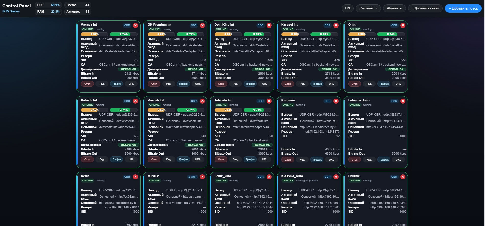
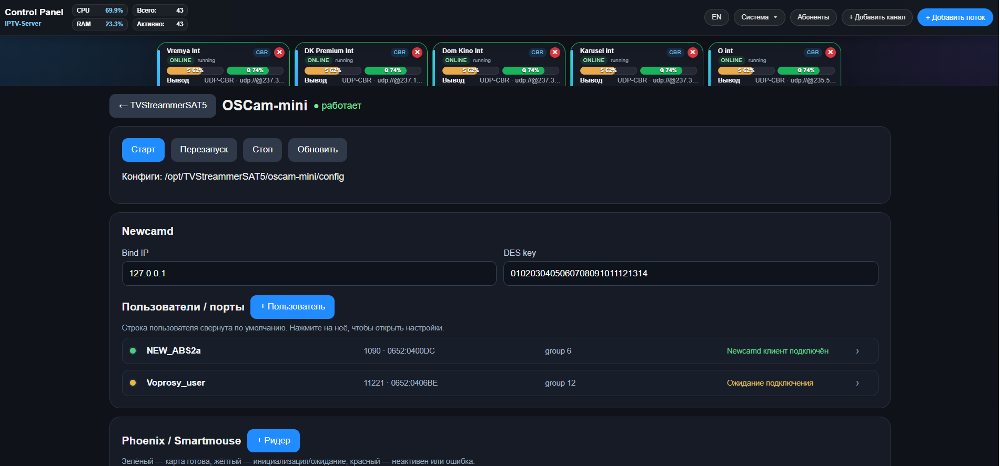

# DVBStreamer5

**Версия: 1.0.0**

## Миграция с GStreamer

В `src/media/` реализовано собственное MPEG-TS/RTP ядро на C++ без
GStreamer: разбор и синхронизация 188-байтовых пакетов, continuity counter,
RTP-пакетизация, UDP-сокеты и нативный HTTP(S) MPEG-TS приём через встроенный cpp-httplib.
Маршруты UDP/RTP и HTTP(S) MPEG-TS к UDP VBR/CBR/RTP, файловый TS к paced
UDP CBR и DVB-S/S2 full-transport-stream к UDP VBR/CBR/RTP подключены к
управлению потоками и не создают GStreamer pipeline.
Приложение пока инициализирует GStreamer глобально для ещё не перенесённых
функций. Для CBR модуль выдаёт постоянный поток семи TS-пакетов
на UDP-датаграмму, заполняет свободную полосу PID `0x1fff` и ограничивает
очередь до 2 MiB, сообщая об ошибке при её переполнении.

Нативный путь включается для простых потоков без транскодирования,
резервного источника и MPTS-маршрутизации. Для HTTP(S) MPEG-TS доступны
access-key в HTTP-заголовке или query string. Для сетевых UDP/RTP-входов
поддерживаются несколько UDP VBR, UDP CBR и RTP-выходов одновременно. Для
входов UDP/RTP с выбранным сетевым интерфейсом native-маршрут сохраняет
multicast membership и на Linux применяет `SO_BINDTODEVICE` для unicast/wildcard.
Для DVB-S/S2 нативный вход на Linux самостоятельно настраивает frontend через
kernel DVB API, управляет LNB/DiSEqC, ставит PID-фильтры и читает TS через
demux/dvr. Сканирование сервисов и чтение signal/quality также используют
Linux DVB API и больше не требуют `dvbsrc`/`appsink`. Нативный DVB-маршрут
может выбрать сервис по SID, сформировать SPTS и передать выровненные пакеты
в выбранный in-place CA backend; для CA захватывается полный TS, чтобы не
терять ECM/EMM. Это пока ограничено отдельными UDP/RTP-выходами и одним
потоком на физический frontend. Пакетный SID/PID remap доступен в
нативном UDP/RTP/HTTP/file/DVB passthrough для выбранной программы и требует
PAT/PMT/SDT-секции, помещающиеся в один TS-пакет. Один физический
frontend пока нельзя одновременно занять двумя нативными потоками.
Браузерные библиотеки предпросмотра из `web/vendor/` встраиваются в исполняемый
файл при сборке; развёрнутому приложению каталог `web/` не нужен. MPEG-2 video
транскодирование отменено. MP2 доступен через in-process транскодирование
TwoLAME; автономный тест кодека не проверяет интеграцию с GStreamer MPEG-TS mux.
Подробности, лицензии и caveats описаны в
[документации по кодекам](docs/TRANSCODER_CODECS.md).
Для локальных MPEG-TS-файлов доступен paced UDP CBR с заданным битрейтом и
завершением потока по EOF; VBR/RTP для файла пока не поддерживается. HLS-вход
использует собственный загрузчик и нативный TS relay для UDP VBR/CBR/RTP без
транскодирования и резервного источника. Нативный relay также напрямую передаёт
нормализованный SPTS в MPTS aggregator без `GstBuffer`. SRT, RTSP, RTMP и
веб-превью пока не перенесены.
Для нативных потоков встроенное веб-превью пока недоступно. Остальные
протоколы будут переноситься отдельными этапами.

Ядро и его тесты можно собрать отдельно от GStreamer; встроенный HTTP(S)-клиент
использует OpenSSL для TLS:

```sh
cmake -S tests/media_core -B build/media-core
cmake --build build/media-core
ctest --test-dir build/media-core --output-on-failure
```

Код GStreamer не подключается как библиотека. Адаптированный алгоритм
обработки неполного хвоста RTP/MPEG-TS и его лицензионное уведомление описаны
в [GSTREAMER_CODE_NOTICES.md](./GSTREAMER_CODE_NOTICES.md).

DVBStreamer5 - сервер маршрутизации, мониторинга и преобразования телевизионных потоков на базе C++17 и GStreamer. Программа принимает сетевые и спутниковые источники, формирует один или несколько выходов для каждого канала и управляется через встроенную русско-английскую веб-панель.





## Возможности

- создание, редактирование, запуск, остановка и удаление потоков из браузера;
- основной и резервный источник с автоматическим переключением и возвратом;
- несколько независимых выходов у одного потока;
- MPEG-TS passthrough или транскодирование видео и аудио;
- CBR/VBR-формирование транспортного потока, контроль PCR и continuity counter;
- переназначение SID, video/audio PID, Service Name и Provider;
- DVB-S/S2 сканирование с выбором адаптера, frontend, транспондера и сервисов;
- совместное использование одного DVB frontend каналами одного транспондера;
- работа с FTA и локальной Conditional Access через CA-плагин и OSCam-mini;
- мониторинг входного/выходного битрейта, ошибок, DVB signal/quality и загрузки интерфейсов;
- список абонентов, фильтрация по IP и отображение активных сессий;
- Telegram-уведомления о состоянии потоков;
- встроенный тестовый источник и библиотека файлов замены;
- Basic Authentication и шифрование пароля панели в конфигурации.

## Архитектура

Обычные потоки обрабатываются внутри процесса без обязательного транскодирования.
Для каждого канала сначала выбирается входной протокол, затем создаётся passthrough
или remap-путь и один основной либо несколько дополнительных выходов.

```text
Входной протокол
      |
      +-- passthrough/remap ----------------------> выходной протокол
      |
      +-- опциональный GStreamer transcoder
              |
              +-- decode
              +-- deinterlace / scale / frame rate
              +-- H.264 + AAC/MP3
              +-- выходной модуль
```

Код протоколов разделён по каталогам:

```text
src/protocols/inputs/          URI-модули входов транскодера
src/protocols/outputs/         URI-модули выходов транскодера
src/protocols/stream/inputs/   входы обычного поточного пути
src/protocols/stream/outputs/  выходы обычного поточного пути
```

## Поддерживаемые протоколы

### Входы

| Источник | Примеры и режимы |
| --- | --- |
| UDP MPEG-TS | unicast, multicast, выбор входного интерфейса |
| RTP MPEG-TS | unicast и multicast |
| SRT | Caller и Listener |
| HTTP MPEG-TS | одиночный поток по HTTP/HTTPS |
| HLS | master/media playlist, сегменты, Header или Query access key |
| RTSP | сетевые камеры и медиасерверы |
| RTMP | RTMP-источники |
| Файл | локальный файл, в том числе файл замены с циклическим воспроизведением |
| DVB-S/S2 | Linux DVB frontend через native kernel API |
| Тестовый сигнал | встроенный `test://bars` |

### Выходы

| Выход | Назначение |
| --- | --- |
| UDP MPEG-TS VBR | передача исходного транспортного потока |
| UDP MPEG-TS CBR | транспортный поток с заданным целевым битрейтом |
| RTP MPEG-TS | доставка MPEG-TS поверх RTP |
| SRT | Caller или Listener |
| HTTP TS | непрерывный MPEG-TS по HTTP |
| HLS | live playlist и MPEG-TS сегменты |
| RTSP Push | публикация на внешний RTSP-сервер |
| RTMP Push | публикация на RTMP-сервер или YouTube |

Для одного канала можно настроить основной и дополнительные выходы разных типов.

H.264-транскодирование поддерживает CPU `x264enc` и NVIDIA NVENC через GStreamer
`nvh264enc`. В режиме `Auto` программа предпочитает NVENC, если элемент `nvh264enc`
доступен, и автоматически использует `x264enc` иначе. Для NVENC требуется рабочий
проприетарный драйвер NVIDIA с поддержкой NVENC и GStreamer `nvcodec`; проверить
сервер можно командами `nvidia-smi` и `gst-inspect-1.0 nvh264enc`.

## Веб-панель

После запуска панель доступна по адресу:

```text
http://SERVER_IP:9000/
```

Начальные учётные данные при первом запуске:

```text
login: admin
password: admin
```

Сразу измените пароль в настройках. Он хранится в `dvbstreamer5-config.json` в зашифрованном виде AES-256-GCM, а локальный ключ создаётся рядом с конфигурацией в файле `dvbstreamer5-ui.key` с правами `0600`.

Основная панель показывает карточки каналов, состояние источника, активный вход, битрейт, режим выхода, ошибки MPEG-TS, DVB-метрики и состояние декодирования. Настройки программы, абоненты, CA-клиенты и окно «О программе» доступны из верхней панели.

## Абоненты и мониторинг подключений

Окно **Абоненты** показывает активные подключения к потокам по HTTP, HLS и SRT. Для каждого IP отображаются номер и название потока, протокол и количество соединений. У зарегистрированного абонента текущие номера потоков видны в колонке сессии.

Незарегистрированный IP можно сразу:

- добавить в абоненты с доступом к выбранному потоку;
- заблокировать независимо от состояния общей IP-фильтрации;
- позднее разблокировать в списке заблокированных адресов.

Список блокировок хранится в `dvbstreamer5-subscribers.json` в поле `blocked_ips`. UDP не устанавливает клиентскую сессию, поэтому приложение не может определить получателей UDP unicast/multicast; для их контроля нужен мониторинг IGMP и сетевого оборудования.

## DVB-S/S2

Диалог добавления спутниковых каналов поддерживает:

- выбор `/dev/dvb/adapterN/frontendN`;
- DVB-S и DVB-S2;
- частоту, symbol rate, поляризацию, FEC и модуляцию;
- DiSEqC A/B/C/D и параметры LNB LOF;
- DVB-S2 ISI / Stream ID с проверкой свойства `dvbsrc stream-id`;
- имя и модель frontend через Linux DVB API, включая TBS6909 и TBS6909-X v2;
- отображение режима драйвера TBS Mode 0 (multiswitch), Mode 1 (direct/DiSEqC)
  и Mode 2 (Unicable);
- просмотр LOCK, signal и quality;
- сканирование PAT/PMT/SDT и выбор найденных сервисов;
- автоматическое сохранение SID, PMT, PCR и elementary PID.

Каналы одного транспондера могут использовать общий физический frontend. Для одновременного приёма другого транспондера требуется другой frontend или остановка текущих каналов на этом устройстве.

Пользователь процесса должен иметь доступ на чтение и запись к `/dev/dvb/*`.

## Conditional Access и OSCam-mini

Проект включает:

- версионированный in-process `CaBackend` ABI;
- плагин `dvbstreamer5-ca-newcamd.so`;
- обнаружение Phoenix/SmartMouse USB reader;
- привязку зашифрованного канала к конкретному CA-клиенту;
- ограничения количества сервисов и состояние декодирования в карточке канала;
- vendored OSCam-mini с Newcamd, Irdeto, Viaccess и Phoenix.

OSCam-mini собирается общей целью CMake и управляется на странице:

```text
http://SERVER_IP:9000/oscam-mini
```

Подробная настройка описана в [OSCAM_MINI.md](OSCAM_MINI.md). Интерфейс плагина описан в [docs/CA_BACKEND_PLUGIN_API.md](docs/CA_BACKEND_PLUGIN_API.md), транспорт Phoenix - в [docs/PHOENIX_SERIAL_TRANSPORT.md](docs/PHOENIX_SERIAL_TRANSPORT.md).

Используйте Conditional Access только с оборудованием, картами и сервисами, для которых у вас есть законные права доступа.

## Системные требования

- Linux `x86_64` (`amd64`); ARM/AArch64 не поддерживается;
- Ubuntu 24.04 или совместимая Debian/Ubuntu система;
- CMake 3.10 или новее;
- компилятор с поддержкой C++17;
- GStreamer 1.0 и наборы Base/Good/Bad/Ugly/Libav;
- OpenSSL; Boost 1.92.0 headers, cpp-httplib, JsonCpp, libdvbcsa и TwoLAME встроены в исходное дерево;
- Linux DVB и Phoenix/SmartMouse устройства - только для соответствующих функций.

## Сборка

Установите зависимости:

```bash
chmod +x install_deps.sh
sudo ./install_deps.sh
```

Соберите приложение со встроенным Newcamd backend и OSCam-mini:

```bash
cmake -S . -B build -DCMAKE_BUILD_TYPE=Release
cmake --build build --parallel
```

Основные артефакты:

```text
build/DVBStreamer5
build/oscam-mini/oscam-mini
```

Проверить архитектуру ELF и оставшиеся динамические зависимости можно командой
`scripts/audit_runtime_deps.sh build/DVBStreamer5`.

## Запуск

Программа читает конфигурацию из текущего рабочего каталога. При первом запуске она создаётся автоматически.

```bash
mkdir -p ~/dvbstreamer5-data
cd ~/dvbstreamer5-data
/path/to/project/build/DVBStreamer5
```

В журнале появится адрес HTTP-порта, по умолчанию `9000`. Для остановки используйте `Ctrl+C` или штатное управление сервисом.

Установка собранных компонентов:

```bash
sudo cmake --install build
```

## Запуск как systemd-сервис

Установите бинарник и создайте отдельный рабочий каталог для конфигурации:

```bash
sudo mkdir -p /opt/DVBStreamer5
sudo install -m 755 build/DVBStreamer5 /opt/DVBStreamer5/DVBStreamer5
```

Пример `/etc/systemd/system/dvbstreamer5.service`:

```ini
[Unit]
Description=DVBStreamer5
After=network-online.target
Wants=network-online.target

[Service]
Type=simple
WorkingDirectory=/opt/DVBStreamer5
ExecStart=/opt/DVBStreamer5/DVBStreamer5
Restart=always
RestartSec=3

[Install]
WantedBy=multi-user.target
```

Активируйте сервис:

```bash
sudo systemctl daemon-reload
sudo systemctl enable --now dvbstreamer5
sudo systemctl status dvbstreamer5 --no-pager --full
```

## Конфигурационные файлы

Все изменяемые данные находятся в рабочем каталоге процесса:

```text
dvbstreamer5-config.json       основные настройки и потоки
dvbstreamer5-ui.key            ключ шифрования пароля панели
dvbstreamer5-subscribers.json  абоненты и IP-фильтрация
backup-files/                     загруженные файлы замены
```

Перед обновлением сохраняйте эти файлы. Не публикуйте конфигурацию: она может содержать сетевые адреса, Telegram token и параметры CA-клиентов.

При запуске в каталоге старой установки программа продолжит использовать файлы
`dvbstreamer5-config.json`, `dvbstreamer5-ui.key` и
`dvbstreamer5-subscribers.json`, если соответствующие файлы с новым именем ещё
не созданы. Установщики также распознают прежний каталог и службу; старые имена
скриптов установки и удаления оставлены как совместимые обёртки.

## Параметры UDP и PCR

Для обычного UDP-выхода программа накапливает 1500 мс данных и начинает передачу
с ближайшего независимо декодируемого видеокадра. Если конкретному приёмнику нужен
прежний пятисекундный стартовый запас, задайте переменную окружения:

```bash
DVBSTREAMER5_UDP_STARTUP_BUFFER_MS=5000
```

Допустимый диапазон: от `250` до `30000` мс. Переменную следует передать процессу
программы или контейнеру через `docker run -e DVBSTREAMER5_UDP_STARTUP_BUFFER_MS=5000 ...`.

Для непрерывных DVB/IP MPEG-TS потоков CBR-выход сохраняет исходный PCR, чтобы
PCR и PTS/DTS оставались в одной временной шкале. Синтетический непрерывный PCR
используется автоматически для сегментированного HLS. Старый режим синтетического
PCR можно принудительно включить переменной:

```bash
DVBSTREAMER5_UDP_FORCE_SYNTHETIC_PCR=1
```

## Docker

Сборка и запуск в Docker используют host networking, чтобы корректно работали
multicast, RTP, SRT listener и привязка к сетевым интерфейсам.

### Сборка образа

```bash
docker build --pull -t dvbstreamer5:202.28 .
```

Для полной пересборки без использования слоёв кеша:

```bash
docker build --pull --no-cache -t dvbstreamer5:202.28 .
```

### Фоновый запуск

Укажите постоянный каталог данных на хосте. Если стандартного файла
`dvbstreamer5-config.json` ещё нет, программа создаст его при первом запуске.

```bash
cd ~/Tvstreamer_sat
mkdir -p /opt/DVBStreamer5

CONTAINER_NAME=dvbstreamer5 \
DETACH=1 \
RECREATE=1 \
IMAGE_NAME=dvbstreamer5:202.28 \
CONFIG_FILE=/opt/DVBStreamer5/dvbstreamer5-config.json \
bash ./scripts/run_container.sh

docker ps --filter name=dvbstreamer5
docker logs --tail 100 dvbstreamer5
```

Скрипт проверяет наличие образа до удаления прежнего контейнера и выводит
идентификатор созданного контейнера. `RECREATE=1` позволяет одной командой
заменить существующий контейнер либо создать его, если контейнера ещё нет.
В фоновом режиме действует политика `unless-stopped`. Скрипт использует host
networking, подключает каталог данных и автоматически передаёт найденные
`/dev/dvb` устройства в контейнер.

Новая конфигурация создаётся без каналов с учётными данными `admin` / `admin`.
После первого входа сразу измените пароль.

Интерактивный временный запуск остаётся доступен без `DETACH=1`:

```bash
IMAGE_NAME=dvbstreamer5:202.28 \
CONFIG_FILE=/opt/DVBStreamer5/dvbstreamer5-config.json \
./scripts/run_container.sh
```

### Управление контейнером

`docker restart` перезапускает уже существующий контейнер с тем же образом.
После пересборки образа эту команду использовать недостаточно: контейнер нужно
удалить и создать заново по инструкции следующего раздела.

```bash
# Состояние контейнера
docker ps -a --filter name=dvbstreamer5

# Текущие и последние 200 строк журнала
docker logs --tail 200 dvbstreamer5
docker logs --tail 200 -f dvbstreamer5

# Перезапуск
docker restart dvbstreamer5

# Остановка и повторный запуск
docker stop dvbstreamer5
docker start dvbstreamer5

# Проверка параметров и состояния
docker inspect dvbstreamer5
```

### Обновление и пересборка проекта

Выполняйте весь блок из корня репозитория. Новый образ сначала полностью
собирается и проверяется Docker, и только затем скрипт заменяет контейнер.

```bash
cd ~/Tvstreamer_sat

git pull origin main
docker build --pull -t dvbstreamer5:202.28 .

CONTAINER_NAME=dvbstreamer5 \
DETACH=1 \
RECREATE=1 \
IMAGE_NAME=dvbstreamer5:202.28 \
CONFIG_FILE=/opt/DVBStreamer5/dvbstreamer5-config.json \
bash ./scripts/run_container.sh

# Контейнер должен иметь состояние Up
docker ps --filter name=dvbstreamer5 \
  --format 'table {{.Names}}\t{{.Status}}\t{{.Image}}'

# Проверка запуска программы
docker logs --tail 100 dvbstreamer5
curl --fail http://127.0.0.1:9000/health
```

Если скрипт завершился ошибкой до строки `Removing existing container`, старый
контейнер остаётся на месте. Сообщение укажет причину, например недоступный образ
или некорректный путь пользовательского конфигурационного файла.

Конфигурация, ключ UI, список абонентов и файлы замены сохраняются на хосте в
каталоге рядом с `CONFIG_FILE`, поэтому удаление и повторное создание контейнера
их не удаляет.

Проверка после пересборки:

```bash
docker ps -a --filter name=dvbstreamer5
docker ps --filter name=dvbstreamer5
docker logs --tail 100 dvbstreamer5
curl --fail http://127.0.0.1:9000/health
```

## Проверка и диагностика

Проверка HTTP-сервера без авторизации:

```bash
curl http://127.0.0.1:9000/health
```

Проверка GStreamer:

```bash
./scripts/check_transcoder_plugins.sh
gst-inspect-1.0 dvbsrc
gst-inspect-1.0 mpegtsmux
```

Для подробного журнала GStreamer:

```bash
GST_DEBUG=2 ./build/DVBStreamer5
```

Если DVB frontend занят, проверьте другие процессы и убедитесь, что каналы на одном физическом frontend настроены на один транспондер. Если нет транскодирования, запустите `scripts/check_transcoder_plugins.sh` и проверьте наличие подходящих видео- и аудиоэнкодеров.

## Лицензии сторонних компонентов

Исходники OSCam-mini и встроенные библиотеки находятся в `third_party/` вместе с файлами лицензий и сведениями об upstream revision. Системные GStreamer и OpenSSL сохраняют лицензии соответствующих пакетов дистрибутива.

## Контакты

Поддержка: [monkipnet@gmail.com](mailto:monkipnet@gmail.com)
